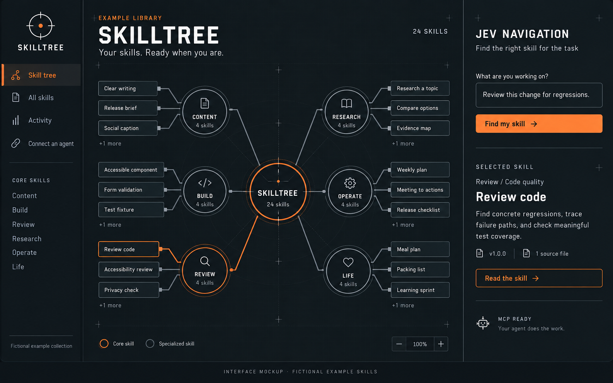

# Skilltree

Your skills, connected. Skilltree is a local-first website and MCP server that turns a collection of agent instructions into a navigable skill tree. Browse the library, ask Jev to choose a path, and hand the current instructions to an agent.



_Illustrative interface mockup. All skills shown are fictional examples included in this repository. [Image generation prompt](docs/preview-prompt.md)._

Skilltree groups capabilities into core skills, branches, and specialized skills. These edges express subject relationships, not mandatory execution order. TypeSafe Jev makes a separate typed choice at each level. Every decision is visible in the activity screen, with probabilities and the selected path.

## Try the example library

Requires Node.js 22.13 or newer.

```sh
git clone https://github.com/its-panzer/skilltree.git
cd skilltree
npm ci
npm run demo
```

Open `http://127.0.0.1:4784`. Explore **24 original example skills**, read their source files, filter work and personal scopes, and inspect activity. Demo mode uses temporary activity storage, ignores private catalogs and credentials, and binds to localhost. Jev routing is unavailable in this mode; it shows labeled local suggestions instead of inventing a decision. Stop with Ctrl-C.

| Core skill | Included examples                                                   |
| ---------- | ------------------------------------------------------------------- |
| Content    | Clear writing, Release brief, Story outline, Social caption         |
| Build      | Typed endpoint, Form validation, Accessible component, Test fixture |
| Review     | Review code, Accessibility review, Dependency check, Privacy check  |
| Research   | Research a topic, Compare options, Interview plan, Evidence map     |
| Operate    | Meeting to actions, Weekly plan, Incident review, Release checklist |
| Life       | Meal plan, Packing list, Home project, Learning sprint              |

Each example is a self-contained, MIT-licensed [SKILL.md](examples/skills) with a focused description and usable instructions. They were written for this framework and contain no personal collection content. Edit the Markdown sources, then run `npm run examples:build` to refresh the catalog.

## Run your own library

Requires Node.js 22.13 or newer. ZIP imports also require Python 3.9 or newer.

```sh
npm ci
cp .env.example .env
npm run dev
```

Open `http://127.0.0.1:4783`. A fresh checkout starts with the 24 example skills until you import a private library. The server, website, and MCP endpoint share one port.

For a persistent production server:

```sh
npm run build
npm start
```

## Import your skills

Create a private `data/private/sources.json` manifest. See [the example manifest](examples/sources.example.json). List only sources you want included, with one stable ID for each skill. Run `npm run import` and restart the server.

- Instructions and supporting files are copied byte-for-byte with executable permissions preserved. Originals remain untouched.
- Versioned candidates outrank unversioned sources. Semantic version ordering includes prereleases; the canonical source breaks ties. Unversioned skills use a content hash as their revision, not an invented version number.
- Authorship, version-selection reasons, excluded duplicates, and source warnings stay in the catalog.
- The importer rejects traversal paths, escaped symlinks, environment files, and unexpected large files. Explicit archive imports reject unsafe members.
- `supportFiles` can include reusable dependencies outside the skill directory. `pathAliases` maps original references into the copied bundle. External applications and live workspace data remain execution dependencies.
- Imports are curated snapshots, not a watcher. New skill directories must be added to the manifest; import again after source changes.

## Jev routing

Set `TYPESAFE_API_KEY` in `.env`, or point `TYPESAFE_ENV_FILE` at a local env file already holding that key. Only the server loads credentials. A route sends the task text and capability descriptions to [TypeSafe Jev](https://docs.typesafe.ai/introduction), using `POST /v1/systemone` and typed Choice questions.

The router chooses category → branch → skill. A choice below 0.65 confidence stops the traversal and asks for context. The route confidence is the minimum confidence along the path; it is a gating heuristic, not a calibrated probability that the whole path is correct. A missing key or failed call shows **unavailable** and separate keyword suggestions. Keyword scores are never presented as Jev probabilities.

Routing metadata can distinguish overlapping skills without changing their instructions. Skilltree selects and retrieves instructions. Your agent executes them in its own environment, subject to its permissions and available tools.

## Connect over MCP

The **Connect an agent** screen produces configuration for the current checkout.

Local stdio:

```json
{
  "mcpServers": {
    "skill-tree": {
      "command": "node",
      "args": ["/absolute/path/to/skill-tree/server/mcp-stdio.mjs"]
    }
  }
}
```

Streamable HTTP is at `/mcp`. It requires `Authorization: Bearer <SKILL_TREE_TOKEN>` for every request. Configure a random token with `openssl rand -hex 32`. Clients must support custom bearer headers; OAuth discovery is not implemented. The server is stateless at the MCP transport layer, while activity is durable in SQLite.

Tools: `get_skill_tree`, `list_skills`, `route_query`, `get_skill`, `get_skill_file`, `get_activity`, and `report_skill_activity`. Resources expose the catalog and individual instructions. Retrieval records a handoff; a reported completion is labeled as the agent's report, not independent verification.

The browser also exposes `browse_skill_tree` and `open_skill` through experimental WebMCP when supported.

## Private access through Tailscale

Keep the server bound to `127.0.0.1`. Use Tailscale Serve, which makes it reachable within your tailnet. Choose an unused HTTPS port so existing services stay intact:

```sh
tailscale serve --bg --https=8443 http://127.0.0.1:4783
```

Set `SKILL_TREE_PUBLIC_ORIGIN` to the exact HTTPS origin and `TAILSCALE_ALLOWED_LOGIN` to your Tailscale account login, then restart. The website accepts the identity header inserted by Tailscale Serve only over the loopback reverse proxy, on that configured host. MCP additionally requires its bearer token. Do not put an untrusted proxy in front of the loopback server. Do not enable Tailscale Funnel for this private library.

Devices running the MCP client must join the same tailnet. A cloud-hosted agent without tailnet connectivity cannot reach this address. The Mac must remain awake and connected. See [operations](docs/operations.md) for service setup and recovery.

## Framework and private collection

The Git repository contains the framework and fictional examples. Your catalog, copied bundles, absolute source paths, activity database, connection settings, and `.env` are ignored. Imported collections may contain work material and adapted upstream skills; their licenses and attribution are independent of this framework. The public repository includes only the framework and its original examples.

Before sharing a source archive, run `npm run check:public` and inspect the tracked file list and history. The check scans tracked files and every commit reachable from HEAD for runtime paths and common secret patterns. It does not identify every possible private skill or sensitive passage; review the actual release against your private catalog too. Export with `git archive`, which excludes ignored files. Binary preview media is allowed only when its exact hash appears in `docs/reviewed-media.json`; review the image itself and its metadata before updating that manifest.

## Checks

```sh
npm run format:check
npm test
npm run build
npm run check:public
```

Tests cover hierarchical routing, confidence gates, provider failure, scope filtering, byte-preserving import, import rollback, bundle path boundaries, persistent activity, HTTP access boundaries, and MCP protocol round trips. Live Jev accuracy still depends on the query and taxonomy; no benchmark accuracy is claimed.

## License and contributions

The framework and original examples are available under the [MIT License](LICENSE). Third-party dependencies retain their own licenses.

Contributions are welcome. See [CONTRIBUTING.md](CONTRIBUTING.md) for development, example-library, and release checks. Never include private skill collections or credentials in issues, screenshots, fixtures, or pull requests.
